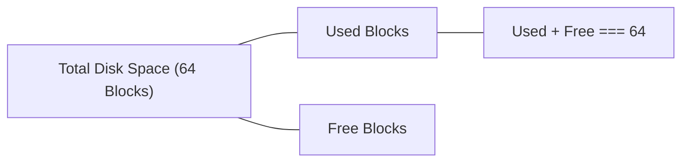

# System Requirements Specification (SRS)
## FileAlloc: File System Block Allocation Visualizer

เอกสารฉบับนี้กำหนดข้อกำหนดของระบบ (System Requirements), สถาปัตยกรรมข้อมูล (Data Architecture), กฎเกณฑ์การจัดสรรพื้นที่ (Allocation Rules), ความถูกต้องของข้อมูล (System Invariants) และข้อจำกัดของโปรเจกต์ **FileAlloc** สำหรับใช้เป็นเกณฑ์อ้างอิงในการพัฒนา ทดสอบ และส่งมอบระบบ

---

## 1. บทนำและวัตถุประสงค์ (Introduction & Objectives)

### 1.1 วัตถุประสงค์
โปรเจกต์ FileAlloc ถูกพัฒนาขึ้นเพื่อใช้เป็นสื่อการเรียนรู้เชิงปฏิสัมพันธ์ (Interactive Educational Tool) สำหรับวิชา **Operating Systems** โดยมีเป้าหมายจำลองและเปรียบเทียบวิธีการจัดสรรพื้นที่บนดิสก์ของระบบไฟล์ (File Allocation Methods) 3 รูปแบบหลัก:
1. **Contiguous Allocation** (การจัดสรรแบบต่อเนื่อง)
2. **Linked Allocation** (การจัดสรรแบบเชื่อมโยง)
3. **Indexed Allocation** (การจัดสรรแบบดัชนี)

### 1.2 ขอบเขตของระบบ (System Scope)
- ทำงานบนเบราว์เซอร์ฝั่งไคลเอนต์ (Client-side Web Application) 100%
- ไม่ใช้ Backend, Database, Package Manager หรือ Build Tools
- ข้อมูลการจำลองถูกเก็บในหน่วยความจำ (In-memory Simulation State) การรีเฟรชหน้าเว็บจะเริ่มต้นใหม่เสมอ
- **ไม่อยู่ในขอบเขต (Out of Scope)**: ระบบผู้ใช้งาน/ล็อกอิน, การอัปโหลดไฟล์จริง, โครงสร้างไดเรกทอรีย่อย (Subdirectories/Folders), และกระบวนการ Defragmentation อัตโนมัติ

---

## 2. โครงสร้างข้อมูลและโมเดลของระบบ (Data Architecture & Models)

### 2.1 Disk Block Model
ระบบจำลองดิสก์ขนาดคงที่จำนวน **64 Blocks** (Block ID: `0` ถึง `63`) แต่ละ Block ประกอบด้วยโครงสร้างข้อมูลดังนี้:

| ฟิลด์ (Field) | ชนิดข้อมูล (Type) | คำอธิบาย |
| :--- | :--- | :--- |
| `id` | `number` (0–63) | หมายเลขระบุตำแหน่งประจำบล็อกบนดิสก์ |
| `status` | `string` (`free` \| `used`) | สถานะการใช้งานของบล็อก |
| `fileId` | `string \| null` | รหัสอ้างอิงไฟล์ที่ครอบครองบล็อก (เช่น `"file-1"`) หรือ `null` หากว่าง |
| `role` | `string \| null` (`data` \| `index`) | หน้าที่ของบล็อก: บล็อกเก็บข้อมูล (`data`) หรือบล็อกเก็บดัชนี (`index`) |
| `nextBlockId` | `number \| null` | พอยน์เตอร์ชี้ไปยังบล็อกถัดไป (สำหรับ Linked Allocation) หรือ `null` |

### 2.2 File Record Model
เมื่อสร้างไฟล์สำเร็จ ระบบจะบันทึกข้อมูลระเบียนไฟล์ (File Record) ดังนี้:

| ฟิลด์ (Field) | ชนิดข้อมูล (Type) | คำอธิบาย |
| :--- | :--- | :--- |
| `id` | `string` | รหัสเฉพาะของไฟล์ สร้างตามลำดับ เช่น `"file-1"`, `"file-2"` |
| `name` | `string` (1–30 ตัวอักษร) | ชื่อไฟล์ที่ผู้ใช้กำหนด (ต้องไม่ซ้ำกันแบบ Case-insensitive) |
| `size` | `number` | ขนาดไฟล์ ระบุเป็น **จำนวน Data Blocks** |
| `allocationType` | `string` | วิธีการจัดสรร (`contiguous` \| `linked` \| `indexed`) |
| `color` | `string` (Hex Code) | สีประจำไฟล์จากชุดสีที่กำหนดล่วงหน้า สำหรับแสดงผลบน Disk Grid |
| `allocation` | `object` | รายละเอียดโครงสร้างตำแหน่งบล็อก ขึ้นอยู่กับประเภทการจัดสรร |

---

## 3. กฎเกณฑ์การจัดสรรพื้นที่ (Allocation Rules)

ระบบใช้คำว่า **`size`** แทน **จำนวน Data Blocks เสมอ** โดยมีข้อกำหนดเฉพาะของแต่ละวิธีดังนี้:

```text
+------------------+-------------------+---------------------------------------------------+
| Allocation Type  | Total Blocks Used | Allocation Strategy & Behavior                    |
+------------------+-------------------+---------------------------------------------------+
| Contiguous       | size              | ค้นหากลุ่ม Free Blocks ที่เรียงติดกันขนาดยาว = size |
| Linked           | size              | สุ่มเลือก Free Blocks ตามจำนวน size แล้วเชื่อม Link  |
| Indexed          | size + 1          | สุ่ม 1 Index Block + สุ่ม Free Data Blocks อีก size  |
+------------------+-------------------+---------------------------------------------------+
```

### 3.1 Contiguous Allocation (การจัดสรรแบบต่อเนื่อง)
1. **การค้นหาพื้นที่**: ระบบจะสแกนหาบล็อกว่างที่มีสถานะ `free` และมีหมายเลขติดกันยาวต่อเนื่องกันเท่ากับ `size` (First-fit จาก Block 0 เป็นต้นไป)
2. **การบันทึกสถานะ**:
   - บล็อกข้อมูลทั้งหมดจะมี `role = "data"` และ `nextBlockId = null`
   - ข้อมูลการจัดสรรระบุ: `startBlock`, `length` (= size), และอาร์เรย์ `dataBlockIds`
3. **การจัดการข้อผิดพลาด (External Fragmentation)**:
   - หากมีพื้นที่ว่างรวมทั้งดิสก์เพียงพอ (`totalFree >= size`) แต่ไม่มีช่วงว่างที่ติดกันยาวพอ ระบบจะปฏิเสธการจองทันทีด้วยรหัสข้อผิดพลาด `EXTERNAL_FRAGMENTATION`
   - หากพื้นที่ว่างรวมไม่เพียงพอ (`totalFree < size`) ระบบจะแจ้ง `INSUFFICIENT_SPACE`

### 3.2 Linked Allocation (การจัดสรรแบบเชื่อมโยง)
1. **การค้นหาพื้นที่**: ใช้ Free Blocks ที่ใดก็ได้บนดิสก์ โดยระบบจะสุ่มเลือกลำดับบล็อกที่ว่างอยู่ตามจำนวน `size`
2. **การบันทึกสถานะ**:
   - ทุกบล็อกมี `role = "data"`
   - แต่ละบล็อกในสาย (Chain) จะเก็บพอยน์เตอร์ `nextBlockId` ชี้ไปยังบล็อกถัดไป
   - บล็อกสุดท้ายของไฟล์จะถูกกำหนดให้ `nextBlockId = null` เสมอ
   - ข้อมูลการจัดสรรระบุ: `startBlock` (บล็อกแรกของสาย) และ `dataBlockIds` (ลำดับบล็อกในสาย)
3. **การจัดการข้อผิดพลาด**: หากบล็อกว่างรวมมีน้อยกว่า `size` จะคืนค่า `INSUFFICIENT_SPACE`

### 3.3 Indexed Allocation (การจัดสรรแบบดัชนี)
1. **การค้นหาพื้นที่**: ต้องการพื้นที่ทั้งหมด **`size + 1`** บล็อก (1 Index Block + `size` Data Blocks)
2. **การบันทึกสถานะ**:
   - บล็อกแรกที่ได้รับเลือกจะทำหน้าที่เป็น **Index Block**: กำหนด `role = "index"` และ `nextBlockId = null`
   - บล็อกที่เหลือจำนวน `size` จะทำหน้าที่เป็น **Data Blocks**: กำหนด `role = "data"` และ `nextBlockId = null`
   - Index Block ไม่ได้เก็บข้อมูลไฟล์โดยตรง แต่ทำหน้าที่ชี้/บันทึกรายการบล็อกข้อมูลทั้งหมดของไฟล์
   - ข้อมูลการจัดสรรระบุ: `indexBlockId` และ `dataBlockIds`
3. **การจัดการข้อผิดพลาด**:
   - หากบล็อกว่างรวมมีน้อยกว่า `size + 1` ระบบจะคืนค่า `INSUFFICIENT_SPACE` พร้อมระบุข้อความชัดเจนว่าต้องการ `size + 1` บล็อก

---

## 4. ข้อกำหนดการตรวจสอบอินพุต (Input Validation Rules)

ก่อนเริ่มกระบวนการจัดสรรพื้นที่ ฟังก์ชัน `validateFileInput` จะตรวจสอบความถูกต้องของอินพุตตามลำดับดังนี้:

| เงื่อนไขการตรวจสอบ | ขอบเขต / กฎเกณฑ์ | ข้อความเมื่อผิดพลาด (Error Message) |
| :--- | :--- | :--- |
| **ชื่อไฟล์ว่าง** | ห้ามเป็นค่าว่างหรือมีแต่ช่องว่าง (Whitespace) | `"Enter a file name."` |
| **ความยาวชื่อไฟล์** | สูงสุดไม่เกิน 30 ตัวอักษร | `"File name must be 30 characters or fewer."` |
| **ชื่อไฟล์ซ้ำ** | ห้ามซ้ำกับไฟล์ที่มีอยู่แล้วในระบบ (Case-insensitive เช่น `test.txt` ซ้ำกับ `TEST.TXT`) | `“A file named “{name}” already exists.”` |
| **ขนาดไฟล์** | ต้องเป็นจำนวนเต็มบวกเท่านั้น (`size >= 1` และไม่มีทศนิยม) | `"File size must be a positive whole number."` |
| **วิธีการจัดสรร** | ต้องเป็นหนึ่งใน `contiguous`, `linked`, `indexed` | `"Select a valid allocation method."` |

---

## 5. ความคงสภาพของระบบ (System Invariants)

เพื่อรับประกันความถูกต้องและความเสถียรของระบบจำลอง ระบบต้องรักษา Invariants ต่อไปนี้ให้เป็นจริงตลอดเวลา (All times):



1. **Space Conservation Invariant**:
   $$\text{Used Blocks} + \text{Free Blocks} = \text{Total Blocks} = 64$$
2. **Free Block Integrity**:
   - บล็อกใดที่มีสถานะ `free` จะต้องมี `fileId === null`, `role === null`, และ `nextBlockId === null` เสมอ
3. **Atomic Allocation (ความปลอดภัยในการจัดสรร)**:
   - หากการจองพื้นที่ล้มเหลว ณ ขั้นตอนใดก็ตาม (ไม่ว่าจาก Input ผิด หรือ พื้นที่ดิสก์ไม่พอ) สถานะของดิสก์และรายการไฟล์ต้องไม่เกิดการเปลี่ยนแปลงโดยเด็ดขาด (No partial modifications)
4. **Complete Block Reclamation (การคืนพื้นที่เมื่อลบ)**:
   - เมื่อสั่งลบไฟล์ (`deleteFile`) บล็อกทั้งหมดที่เป็นของไฟล์นั้น (ทั้ง Data Blocks และ Index Block กรณี Indexed) จะต้องถูกรีเซ็ตสถานะกลับเป็น `free` ครบถ้วน 100%
5. **Chain Termination**:
   - ใน Linked Allocation บล็อกสุดท้ายของห่วงโซ่ต้องมี `nextBlockId === null` เสมอ ห้ามเกิดวงวน (Infinite Loop)
6. **External Fragmentation Enforcement**:
   - Contiguous Allocation จะต้องปฏิเสธการจัดสรรเสมอ หากไม่มีบล็อกว่างที่เรียงติดกันยาวเพียงพอ แม้ว่า `freeBlocks >= size` ก็ตาม

---

## 6. วงจรชีวิตและการจัดการสถานะ (State & Lifecycle)

### 6.1 การรีเซ็ตระบบ (Reset Simulation)
- เมื่อกดปุ่ม Reset (มีกล่องยืนยัน Confirmation Dialog หากมีไฟล์ในระบบ)
- ดิสก์ทั้งหมด 64 บล็อกจะกลับสู่สถานะเริ่มต้น (`status = "free"`, ID: 0–63)
- ล้างรายการไฟล์ทั้งหมด (`files = []`)
- ยกเลิกการเลือกไฟล์ (`selectedFileId = null`)
- รีเซ็ตตัวนับ ID ไฟล์กลับเป็น `nextFileId = 1`

### 6.2 การเลือกไฟล์และไฮไลต์ (Selection & Highlighting)
- เมื่อคลิกที่การ์ดไฟล์หรือบล็อกของไฟล์นั้น ไฟล์จะถูกเลือก (`selectedFileId`)
- บล็อกของไฟล์ที่ถูกเลือกจะแสดงสถานะ Highlight เด่นชัดขึ้น ส่วนบล็อกอื่นๆ จะ Dim ลง
- การคลิกซ้ำที่ไฟล์เดิมจะเป็นการยกเลิกการเลือก (Deselect)

---

## 7. ขอบเขตความรับผิดชอบของทีมงาน (Team Responsibility Contract)

| สมาชิก | บทบาทความรับผิดชอบ | ไฟล์ที่ดูแล |
| :--- | :--- | :--- |
| **โอห์ม (Ohm)** | Core System & Algorithms | `js/constants.js`, `js/models.js`, `js/allocators.js`, `js/simulation.js`, `js/app.js` |
| **อาร์ต (Art)** | UI, Styling & Visualization | `css/styles.css`, `js/ui.js`, `index.html` (Layout Only) |
| **โชกุน (Shogun)** | Testing, Specifications & Demo Script | `docs/requirements.md`, `docs/test-cases.md`, `docs/demo-script.md`, `README.md` |
